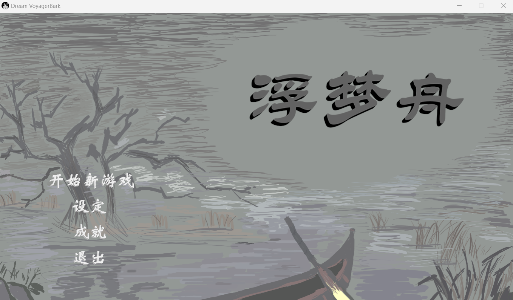
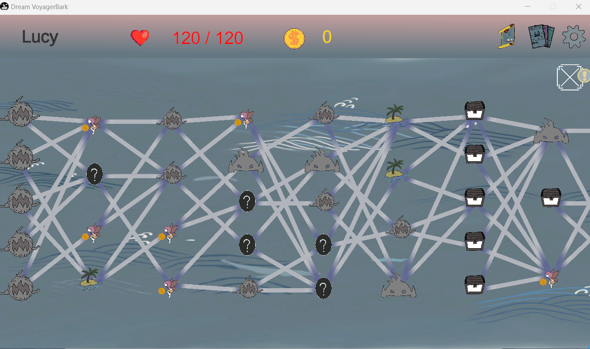
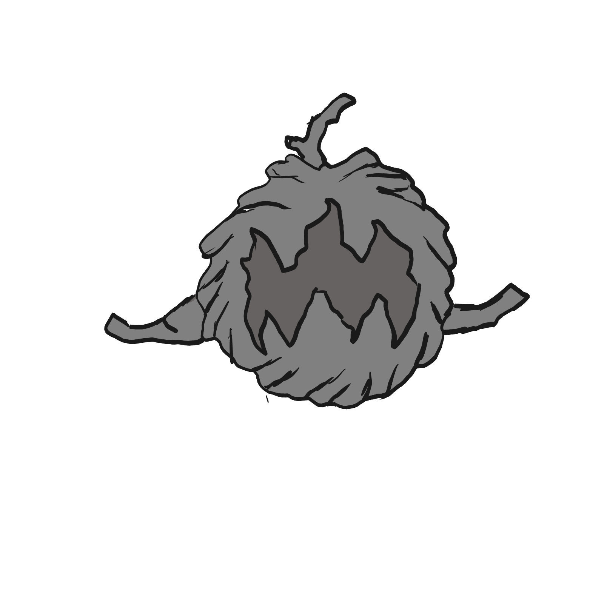
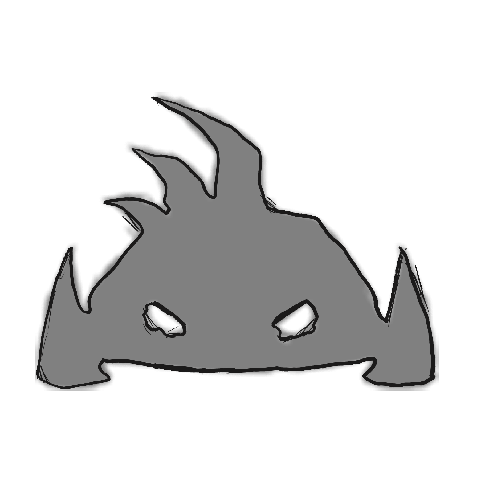
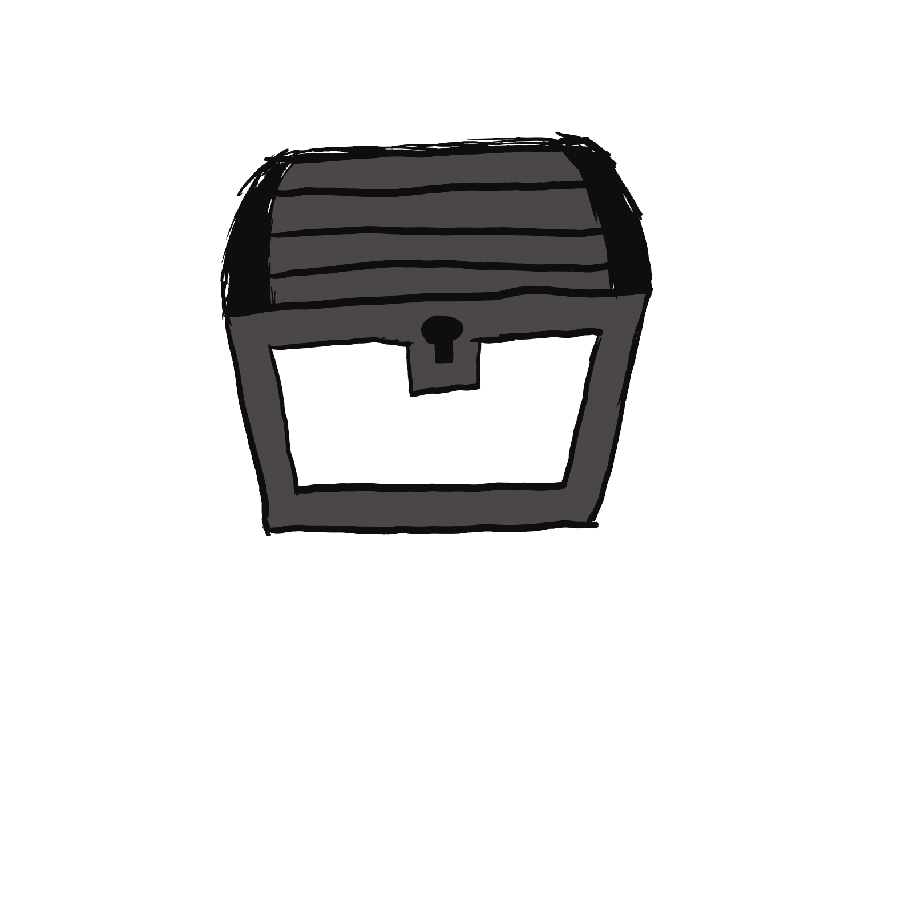
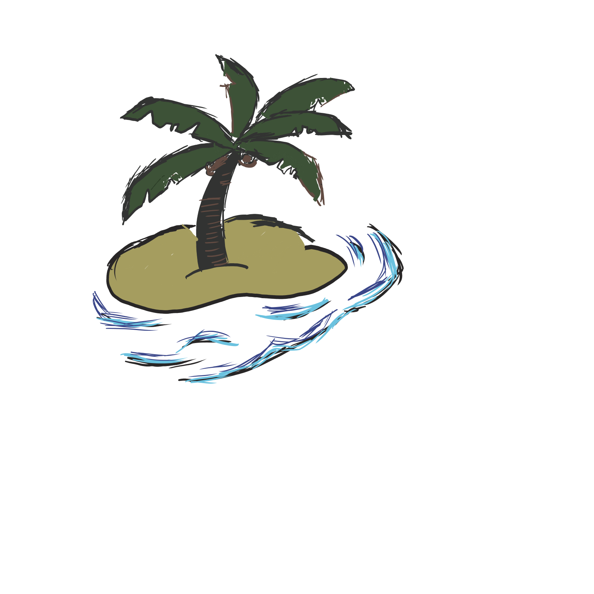
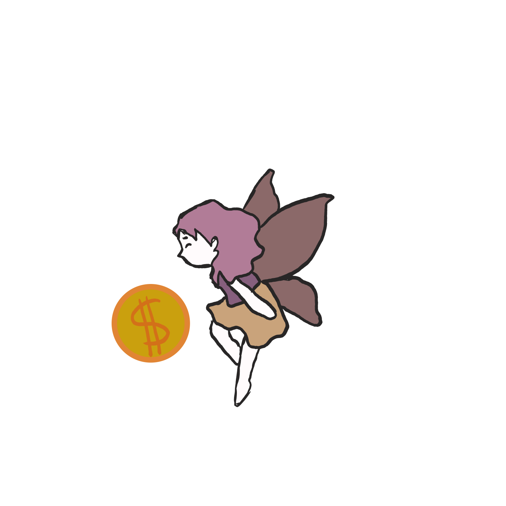
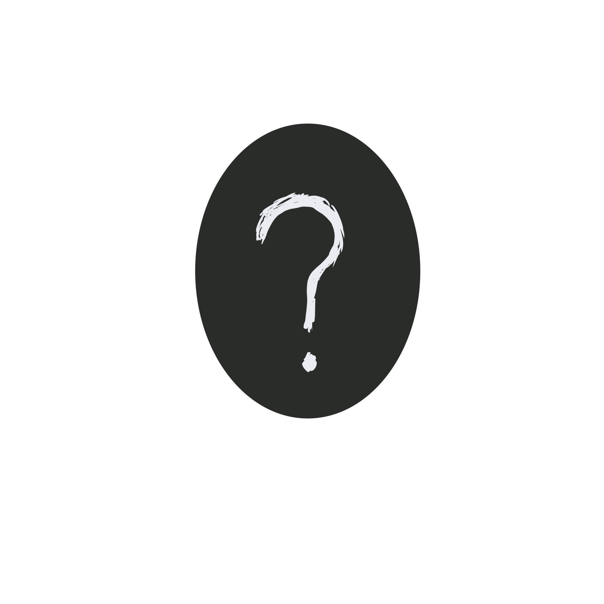
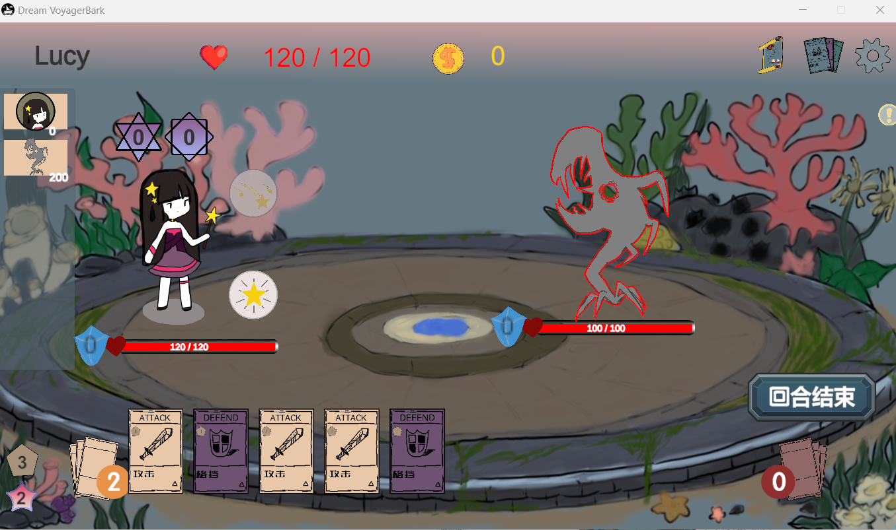

## 游戏介绍

《浮梦舟》是一款回合制肉鸽卡牌游戏，游戏参考了经典肉鸽卡牌游戏《杀戮尖塔》，并在此基础上加入了新的机制。

### 游戏背景

在这款游戏中，玩家将踏入名为“幻梦之境”的世界，面对无数未知的挑战与怪物（梦魇）。做为“梦舟主”的你（船长），需要带领你的“梦舟师”（角色），在梦海上穿行，遭遇各种事件，最后击败强大的梦魇（boss），拯救那些被困在梦境中的人。

### 游戏特色

#### 卡牌系统

卡牌系统是《浮梦舟》的核心玩法之一。玩家需要精心构建自己的卡牌组合（每局随机），通过合理的搭配和使用，提升战斗力，应对各种战斗挑战。游戏中的卡牌分为攻击牌、防御牌、技能牌和能力牌等多种类型，每种卡牌都有其独特的效果和用途，为玩家提供了丰富的策略选择。在此基础上，还加入了新的机制——牌分为通用牌与专属牌（即某个角色专有），通用牌只能用通用能量消耗，专属牌能用通用能量和专属能量消耗。

#### 速度回合机制

速度与回合也是《浮梦舟》的特色之一，主要参考了《崩坏·星穹铁道》的回合系统。简单来说，速度越快的角色行动次数越多，可能也会出现连续行动的情况。当然，怪物也不会都是固定速度，可能也会出现高速的怪物给玩家带来挑战。

## 游戏教程

### 主界面

主界面中有四个按钮

* 开始新游戏：是进入游戏的按钮
* 设定：在设置中调节音量
* 成就：查看成就界面
* 退出：退出游戏

### 游戏界面

#### 地图界面

地图界面如图所示，地图中有不同的结点，当前可以选择的结点，会重复变大变小的动画标识，结点之间的连线标识节点之间是否可到达。

接下来介绍不同种类的结点：

* 

    

      
    

    

      怪物结点，与怪物进行战斗，战斗胜利可以获得卡牌和金币
    

  

* 

    

      
    

    

      精英怪结点，与精英怪进行战斗，战斗胜利可以获得更强的卡牌和更多的金币
    

  

* 

    

      
    

    

      宝箱结点，在该处可以获得卡牌
    

  

* 

    

      
    

    

      休息结点，在该处可以选择获得卡牌或是回复状态
    

  
  

* 

    

      
    

    

      商人结点，在该处可以消耗金币购买卡牌
    

  
 

* 

    

      
    

    

      随机结点，在该处会随机遭遇一个事件
    

  

  以下是只会出现在随机事件中的事件

  

    

      
    

    

      湍流结点，在该处会被冲到相邻的结点，可自己选择前往哪一个结点
    

  
 
  

    

      
    

    

      回流结点，在该处会被冲到上一层的结点，可自己选择前往哪一个结点
    

  
 
  

    

      
    

    

      触礁结点，在该处遭遇负面事件，但可自己选择遭遇哪一类事件
    

  
 

* 

    

      
    

    

      Boss结点，在该处与Boss进行决战
    

  
 

#### 战斗界面

战斗界面如图所示

左侧为角色和怪物的行动条，表示了角色和怪物的行动顺序

左下侧为当前拥有的能量，上面为通用能量，下面为专属能量。

牌堆有两种，左边的为抽牌堆，表示还未抽到的牌，右边为弃牌堆，表示已经打出过的牌，两种牌堆都可点击查看详情。

下面的牌为手牌，指针移动到牌面上会有一个放大的提示。

角色和敌人都有血条和护盾，不做赘述。

